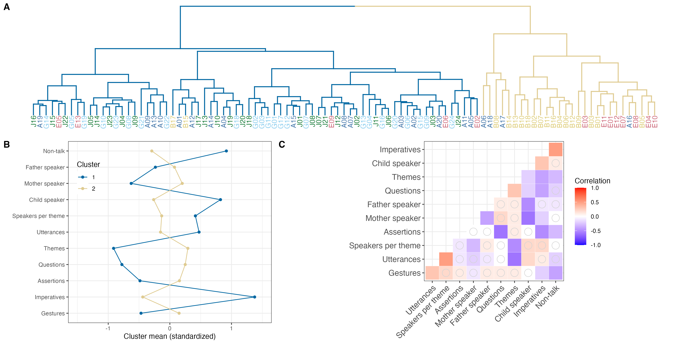

```{r setup, include = FALSE}
library("papaja")
library(tidyverse)
library(ggthemes)
library(ggridges)
library(ggcorrplot)
library(brms)
library(ggpubr)
library(NatParksPalettes)
library(tidybayes)
library(factoextra)

```

```{r analysis-preferences}
# Seed for random number generation
set.seed(42)
knitr::opts_chunk$set(cache.extra = knitr::rand_seed)
```

Children learn language in interactions with language-competent others [@clark2009first; @tomasello2009constructing; @bruner1983child; @levinson2014origin; @bohn2019pervasive].Explaining how children accomplish this feat poses a serious challenge because social interactions between children and their social partners are structured by norms, values, and beliefs that vary across cultural and historical contexts [@rogoff2003cultural]. As a consequence, children may encounter dramatically different language learning environments. Yet, the fact that children usually achieve fluency in their local language(s) suggests that they use a suite of compensatory learning strategies to adapt flexibly to their respective learning environment [@rowe2020language; @cristia2022systematic; @kidd2022diverse]. Detailed documentation of learning environments across cultural contexts is needed to inform theorizing about children’s learning processes. In this paper, we contribute to this effort by reporting on cross-cultural variation in parent-child communicative interactions in a semi-structured setting: meals involving parents and their 2-year-old child.

In recent decades, research on language acquisition has focused, to a large extent, on variation in language input and, in particular, the number of words children hear in naturalistic settings. This line of work was sparked by the finding that children who receive more input -- especially speech directly addressing them -- have better language skills [@hart1995meaningful; @weisleder2013talking; @bang2022spanish; @huttenlocher1991early; @walker1994prediction; @shneidman2012language]. From a theoretical perspective, more language input increases children’s opportunities for learning word-meaning mappings and allows them to build a larger vocabulary [@mcmurray2012word; @kachergis2022toward; @jones2017diversity]. The introduction of daylong audio recording devices and automated coding algorithms has provided further momentum to this endeavor [@lavechin2020open; @greenwood2011assessing; @cristia2021thorough]. As a consequence, the quantity of direct language input plays a central role in theories and formal models of language learning [@swingley2018quantitative; @braginsky2019consistency; @goodman2008does; @kachergis2022toward].

However, like most of developmental psychology [@nielsen2017persistent; @amir2020cross], research on language acquisition has largely focused on affluent societies of the global north and, as a consequence, the resulting theoretical proposals may fail to generalize to other cultural contexts. As studies in a greater variety of cultural settings have begun to accumulate [@casillas2021early; @bergelson2019north; @bunce2020cross; @loukatou2021child; @cristia2019child; @altinkamics2014context; @choi2000caregiver; @tardif1997caregiver], they have revealed substantial cultural variation in how much direct input children receive [@cristia2022systematic; see also @sperry2019reexamining for variation within an English-speaking sample]. Yet, children still reach major milestones in language development at similar ages [@casillas2020early; @brown2014language]. These findings highlight that theories and models of language learning need to extend beyond quantity of input and also include learning processes that compensate for variation in input [@kachergis2022toward; @jones2017diversity; @meylan2022learning; @bang2022time; @casillas2022learning].

It has been suggested that these compensatory learning processes leverage structural features of social interactions in which language is used [@rogoff2003firsthand; @casillas2020early; @shneidman2012language; @shneidman2016child]. Pragmatic accounts of language learning offer an explanation for how children use contextual information [e.g., @bohn2019pervasive; @tomasello2009constructing]: Social interactions, especially routines, follow predictable patterns that make it easier for children to infer what speakers are communicating about [@lieven1994crosslinguistic; @de2022ten; @masek2021beyond]. For instance, @roy2015predicting found that words were more easily learned when they were primarily used in a distinct spatial and temporal context. Similarly, establishing common ground over the course of an interaction provides information about the speaker’s intention independent of the words that are being used [@bohn2018common; @bohn2021young]. For example, @bohn_le_peloquin_koymen_frank_2020 showed that children identify the referent of an ambiguous word by inferring the topic of an ongoing conversation [see also @akhtar2002relevance]. These findings help to explain why the amount of conversational turn-taking in parent-child interactions predicts child language outcomes [@romeo2018beyond; @donnelly2021longitudinal]. Turn-taking results in continuous, structured conversations that provide information-rich learning opportunities.

In order to assess whether children can use structural features to complement direct verbal input, it is crucial to compare communicative interactions between adults and children across cultural settings. However, to our knowledge, there are very few quantitative comparisons. While ethnographic descriptions offer important and rich insights into individual cultural settings [see e.g., @de2011language; @gaskins2006cultural], quantitative comparisons are essential for understanding gradual cultural differences [@koester2022parental; @broesch2021opportunities; @hewlett1998culture] and offer core input for theory building (see language input studies discussed earlier).

One of the challenges of cross-cultural work lies in selecting an appropriate context for comparing the structure of communicative interactions [@broesch2022roadmap]. Work in Western-affluent settings has shown that the amount of language input children receive varies substantially across routine activities. For example, @soderstrom2013caregivers found that Canadian adults spoke most during book reading and structured playtime [see also @tamis2019routine]. Such activities, however, are very specific to Western, affluent settings and less frequent or absent in other cultural contexts. A particularly promising context for cross-cultural research appears to be mealtimes: across societies, meals are social events that are structured by -- and used to transmit -- cultural norms, values and beliefs [@ochs2006cultural; @fjellstrom2004mealtime; @blum2012dinner; @koester2022parental]. Furthermore, mealtimes have been a fruitful context for studying caregiver-child communication in a Western context, for example, in the U.S. [e.g., @beals1993explanatory; @beals1997sources; @snow2006mealtime].

# The current study

The goal of this study was to compare communicative interactions between parents and their children during mealtime across diverse cultural settings. We aimed for a naturalistic but comparable setup by a) asking families to record in their homes, b) recruiting families with children between 2 and 3 years of age and c) focusing on 10-minute-long episodes during which all three family members (mother, father, child) were present. Even though the constellation of two parents and one child might be less representative of the overall family demographics in some settings, it allowed us to directly quantify and compare communicative interactions. We obtained recordings from five different cultural settings, including families living in the Global South and North, as well as in urban and rural settings: the city of Buenos Aires, Argentina, small villages in the Apeú region, Brazil, small villages close to Cotacachi, Ecuador, the city of Münster, Germany, and the city of Kyoto, Japan.

We coded and analyzed the data along nine dimensions that focused on the quantity of talk and gestures as well as their conversational embedding (interlocutors, speech acts, themes). In a first step, we analyzed if and how these dimensions differed in the five cultural settings. In a second step, we asked whether some cultural settings are more similar to one another. The five cultural settings offer an interesting perspective on the factors influencing mealtime conversations. For example, communicative interaction patterns could cluster by country (five clusters; one cluster per country), or by language family and geographical region (three clusters; Argentina, Brazil, Ecuador vs. Germany vs. Japan) or by degree of urbanization (two clusters; urban: Argentina, Germany, Japan vs. rural: Brazil, Ecuador). Based on previous work, we expected less direct input to children in the rural contexts (Cristia, 2022) but -- given a lack of comparable previous work -- we had no specific predictions for variation in the structure of communicative interactions.

# Methods

## Participants

```{r}
data <- read_csv("../data/data.csv")

dem <- data%>%
  group_by(country)%>%
  summarise(n = n_distinct(family))
```

The final sample consisted of `r sum(dem$n)` families from five cultural contexts. This included `r dem%>%filter(country == "Argentina")%>%pull(n)` families from the city of Buenos Aires, Argentina (urban setting), `r dem%>%filter(country == "Brazil")%>%pull(n)` families from villages in the Amazon region near Apeú, Brazil (rural setting), `r dem%>%filter(country == "Ecuador")%>%pull(n)` from villages near Cotacachi, Ecuador (rural setting), `r dem%>%filter(country == "Germany")%>%pull(n)` families from the city of Münster, Germany (urban setting) and `r dem%>%filter(country == "Japan")%>%pull(n)` families from the city of Kyoto, Japan (urban setting). For the recording sessions, all families comprised a father, a mother and a child aged between 2 years and 3 years, 2 months. Some videos partly included additional children (n = 1 for Argentina, Brazil and Ecuador).

Additional families were recorded but they did not meet the inclusion criteria of at least one recording of a meal that lasted for at least ten minutes, initially included all three family members and had all family members visible in the recording. This resulted in the exclusion of 11 families from Münster, Germany, 34 from Apeú, Brazil, five from Buenos Aires, Argentina, 39 from Cotacachi, Ecuador and five from Kyoto, Japan.

The recordings were collected as part of a larger cross-cultural investigation into parent-child interactions and findings on parental teaching behaviors have been published by @koester2022parental. We refer to this earlier work for a detailed description of each cultural setting. In the following we only provide a short overview.

### Argentina

Families lived in the metropolitan area of Buenos Aires, Argentina, which comprises around 15.2 million people. They were recruited via personal contacts of the local experimenter. The family language was Rioplatense Spanish. Compensation included small toys for children and USD 10 for parents. Most parents had completed a university degree (mothers: 74%; fathers: 52%) and engaged in paid professional labor (mothers: 87%; fathers: 78%). The majority of children (91%) either attended kindergarten or were looked after by a nanny or a family member other than the parents. 

### Brazil

Families lived in villages of around 50 - 300 families in the Amazon region near Apeú, approximately 1.5 hours east of Belém, the capital of the state of Pará. They were recruited with the help of a local public health office. The family language was Brazilian Portuguese. Compensation included small toys for children and a certificate of participation for parents. Most parents had completed secondary school (~12 years of schooling, mothers: 50%; fathers: 56%). Mothers worked mainly as housewives (83%) while fathers engaged in paid labor (100%). Some families engaged in traditional subsistence activities such as tapioca farming, livestock breeding, or acaí and fruit harvesting. In line with employment status, the majority of children were looked after by their mothers.

### Ecuador

Families lived in villages with 800-5,000 inhabitants located within 1 hour (by car) of the city of Cotacachi in the Imbabura province. They were recruited via personal contacts mediated by the community president. The family language was Ecuadorian Spanish with elements of Kichwa. Compensation included food (e.g., rice or oat) and USD 4. Most parents had completed primary school (~10 years of schooling, mothers: 50%; fathers: 56%). Mothers worked mainly as housewives (59%) while fathers engaged in paid labor (77%). Around 40% of children were looked after by a person other than the mother during the day.

### Germany

Families lived in Münster in the state of North-Rhine-Westphalia, a city with ~310,000 inhabitants. They were recruited via a participant database of the Developmental Psychology lab at the University of Münster. Compensation included a voucher of EUR 15 for a local toy store. Most parents had completed a university degree (mothers: 71%; fathers: 71%) and engaged in paid professional labor (mothers: 92%; fathers: 92%). All children either attended kindergarten or were looked after by a nanny during the day. 

### Japan

Families lived in the city of Kyoto, in the Kansai metropolitan region, with around 1.5 million inhabitants. They were recruited via a participant database of the Center for Baby Science at Doshisha University. Compensation was JPY 3000. Most parents had completed a university degree (mothers: 92%; fathers: 83%) and engaged in paid professional labor (mothers: 71%; fathers: 100%). Most children (80%) attended kindergarten.

The study was approved by the ethics committee of the Free University of Berlin. Recordings took place between September 2017 and March 2019. Informed verbal consent was obtained from both parents and written consent from one of the parents.
 

## Procedure

We visited families twice. On the first visit, an experimenter (familiar with the local language) instructed parents on how to use the video camera and what to record. We encouraged families to record two instances of the meal they commonly shared together, which happened in the evening for most families. The cameras were equipped with a wide-angle lens and set up to capture all family members during the meal. In addition to video, the cameras also recorded sound. On the second visit, the experimenter asked about the recordings and encouraged families to record additional meals if they had not already recorded two sessions. In the end, we collected socio-demographic information and interviewed the mothers (unrelated to the present study).

## Coding

We scanned all recordings for sections that captured a meal event, lasted at least 10 minutes, and included all three family members. For each family, we selected one such section for in-depth coding and excluded all families for which we did not find such a section (see above for the number of excluded families).

We coded videos using ELAN [@wittenburg_elan_2006] version 6.4. The primary coder was either a native (Germany, Japan, Brazil) or a highly fluent (Argentina, Ecuador) speaker of the local language. For Ecuador, a native speaker translated sections containing Kichwa into Spanish before the primary coder coded them.

In a first pass, the primary coder created a tier for each speaker and marked segments in which this person was speaking or using a gesture. In a second pass, the coder transcribed all utterances into the local language and coded their conversational embedding. We defined utterances as sections of continuous talk by one person. If speakers paused for more than 2 seconds, we coded two utterances with 2 (or more) seconds of silence in between. We used the following codes to capture the conversational embedding of each utterance:

### Speaker 

Here we coded who produced the utterance. The speaker could either be `child`, `mother`, or `father`. All sections containing no speech were coded as `silence`.

### Recipient

Here we coded who the utterance was addressed to. Codes could either be `child`, `mother`, `father`, `both` or `other`, where `other` was used either when a fourth person (e.g., over the phone) was addressed or the speaker was talking to themselves (e.g., child babbling or singing). If an utterance addressed two people in sequence, the second addressee was coded as the recipient.

### Themes and rounds

Here we coded the conversational coherence of the different utterances. For that we defined `themes` as sequences of utterances that related to one another. This applies for example to sequences of questions and answers but also to sequences in which the content of an utterance is directly related to the content of the previous utterance. Please note that such themes were coded locally and were not the same as topics. For example, if father and child exchanged four utterances about the child’s day in the kindergarten this was coded as one theme. If the same topic (day at the kindergarten) came up later again, this was coded as a separate theme. Each utterance within a theme was counted as a `round` to capture the sequence and length of a theme. Thus, each utterance was assigned a number for the theme and a number for the round within theme. Themes could have interjections of one or two utterances. After more than two interjections we coded a new theme. For example, if father and child talked about food and the mother made an unrelated comment in between, the mother’s comment would be coded as a separate theme while the other theme continued around it:

Child: "I want more"	 			        (theme (t) 1, round (r) 1)

Father: "Do you want more soup?"		(t1, r2)

Mother: "Phew, I'm hot			        (t2, r1)

Child: "No, bread				            (t1, r3)

Father: "I'll get some"			        (t1, r4)

### Speech acts

Each utterance was coded as either being a `question`, `assertion` or `imperative`. Imperatives were only coded if the the utterance was grammatically structured as an imperative. For example "Pass me the salt!" was coded as an imperative while "You should give me the salt." was not.

### Referential gestures

We also coded the frequency of two types of referential gestures for each individual. `Points` were coded when someone indicated an object, location or person in the environment, either using a finger (often index finger), the head or an object (e.g., cutlery). Reaches and hold-outs were not coded as points. `Iconic` gestures were coded when someone depicted an object or action using their hands and/or body (e.g., pretending to hold a knife and cut to instruct the child how to cut a cucumber). Conventional gestures such as head shaking, nodding or shrugging were not coded.

### Reliability coding

```{r}
reli <- read_csv("../data/reliability.csv")%>%
  mutate_if(is.numeric, round, 2)%>%
  mutate(match = round(match*100))
```

For each cultural setting, we selected 15% of videos and had them re-coded by a second coder (native speaker of the respective language). The second coder relied on the sequencing of the primary coder. Inter-rater reliability was generally very good. For recipient, the agreement between coders was `r reli%>%filter(type == "recipient")%>%pull(match)`% ($\kappa$ = `r reli%>%filter(type == "recipient")%>%pull(kappa)`), for speech acts it was `r reli%>%filter(type == "speechact")%>%pull(match)`% ($\kappa$ = `r reli%>%filter(type == "speechact")%>%pull(kappa)`) and for gestures it was `r reli%>%filter(type == "gesture")%>%pull(match)`% ($\kappa$ = `r reli%>%filter(type == "gesture")%>%pull(kappa)`). To get inter-rater reliability for the coding of themes, we asked whether the two coders agreed on whether a given utterance belonged to the same theme as the previous utterance or belonged to a new theme. Once again, agreement between coders was high (agreement = `r reli%>%filter(type == "theme")%>%pull(match)`%, $\kappa$ = `r reli%>%filter(type == "theme")%>%pull(kappa)`).

# Analysis and Results

For each of the research questions (see below), we defined a response variable and then used Bayesian multilevel regression models fit via the function `brm` from the package `brms` [@burkner2017brms] to model the effect of cultural setting and -- whenever applicable -- that of the different individuals involved in the conversation. To make inferences about the importance of predictors, we compared a set of nested models including cultural setting and individual as predictors to each other and to a null model that did not include them to test if these predictors improved model fit. Following @mcelreath2018statistical, we compared models using Widely Applicable Information Criteria (WAIC) and the corresponding weights. This approach favors models that have high out-of-sample predictive accuracy in that they achieve a good fit to the data with the minimal set of parameters.

We modeled the effect of cultural settings as random effects and interactions between additional variables (e.g., speaker identity) and setting as random slopes within cultural setting (`brms` notation: `(variable|setting)`). This approach partially pools model estimates and is thought to yield more generalizable results because it avoids overfitting the model to the observed data [@gelman2006data; @mcelreath2018statistical]. For each model comparison, we visualized the predictions of the winning model and interpreted them based on their posterior means and 95% Credible Intervals (CrI). We used default priors built into `brms` for all parameters.

## How much time did families spend talking?

```{r}
# silence_data <- data%>%
#   filter(speaker == "silence")%>%
#   group_by(country,family)%>%
#   summarise(silence = sum(duration)/60000)
# 
# bm1_0 <- brm(silence ~ 1,
#            data = silence_data,
#            family = gaussian(),
#            iter = 6000, warmup = 2000, cores = 4, chains = 4,
#            backend = "cmdstanr"
#            )%>%
#   add_criterion(., c("waic","loo"))
# 
# bm1_1 <- brm(silence ~ 1+ (1|country),
#            data = silence_data,
#            family = gaussian(),
#            iter = 6000, warmup = 2000, cores = 4, chains = 4,
#            backend = "cmdstanr"
#            )%>%
#   add_criterion(., c("waic","loo"))
# 
# comp_silence <- left_join(
#   loo_compare(bm1_1, bm1_0, criterion = "waic")%>%as_tibble(rownames = "model"),
#   model_weights(bm1_1, bm1_0, weights = "waic")%>%as_tibble(rownames = "model")%>%rename(weight = value))%>%
#   mutate_if(is.numeric, round, 2)%>%
#   mutate_if(is.numeric, format, nsmall = 2)
# 
# saveRDS(bm1_1, "../saves/bm1_1.rds")
# saveRDS(comp_silence, "../saves/comp_silence.rds")

comp_silence <- readRDS("../saves/comp_silence.rds")
bm1_1 <- readRDS("../saves/bm1_1.rds")

fix_b1_1 <- fixef(bm1_1)%>%as_tibble(rownames = "term")%>%mutate_if(is.numeric, round, 2)
```

```{r}
# post_silence <-silence_data%>%
#   distinct(country)%>%
#   add_epred_draws(bm1_1, re_formula =~(1|country))
# 
# p_silence <- ggplot(post_silence, aes(x = .epred, y = country))+
#   geom_point(data = silence_data, aes(x = silence, y = country),pch = 1,alpha = .5)+
#   stat_halfeye(alpha = .75, .width = c(0.66, 0.95),)+
#   xlim(0,10)+
#   labs(x = "Silence in minutes", y = "")+
#   theme_bw()
```

First, we ask how much time families spent talking as opposed to being silent and how this varied across cultural settings. The dependent variable in this case was the total lengths of all sections coded as silence for each family (modeled as a normal distribution). We compared a null model including only an overall intercept (`silence ~ 1`) to a model including cultural setting (`silence ~ 1 + (1|setting)`).

The model comparison clearly favored the model including cultural setting (WAIC = `r comp_silence%>%filter(model == "bm1_1")%>%pull(waic)`, se = `r comp_silence%>%filter(model == "bm1_1")%>%pull(se_waic)`, weight = `r comp_silence%>%filter(model == "bm1_1")%>%pull(weight)`) over the null model (WAIC = `r comp_silence%>%filter(model == "bm1_0")%>%pull(waic)`, se = `r comp_silence%>%filter(model == "bm1_0")%>%pull(se_waic)`, weight = `r comp_silence%>%filter(model == "bm1_0")%>%pull(weight)`). The model predicted an average of `r fix_b1_1%>%pull(Estimate)` [95%CrI = `r fix_b1_1%>%pull(Q2.5)` - `r fix_b1_1%>%pull(Q97.5)`] minutes of silence across cultural settings. Ecuador and Brazil had longer sections of silence compared to Argentina and Germany, with Japan falling in the middle (see Figure \@ref(fig:fig1)A). 

## How much talk is directed at each family member?

```{r}
input_data <- data%>%
  filter(speaker != "silence",
         recipient %in% c("c","f","m"))%>%
  mutate(recipient = recode(recipient,
                            "c" = "child",
                            "m" = "mother",
                            "f" = "father"))%>%
  group_by(country,family,recipient)%>%
  summarise(input = sum(duration)/60000)

# bm2_0 <- brm(input ~ 1 + (1|family)+ (1|country),
#            data = input_data,
#            family = skew_normal(),
#            control = list(adapt_delta = 0.95),
#            iter = 6000, warmup = 2000, cores = 4, chains = 4,
#            backend = "cmdstanr"
#            )%>%
#   add_criterion(., c("waic","loo"), moment_match = T)
# 
# bm2_1 <- brm(input ~ recipient + (1|family) + (1|country),
#            data = input_data,
#            family = skew_normal(),
#            control = list(adapt_delta = 0.95),
#            iter = 6000, warmup = 2000, cores = 4, chains = 4,
#            backend = "cmdstanr"
#            )%>%
#   add_criterion(., c("waic","loo"), moment_match = T)
# 
# bm2_2 <- brm(input ~ recipient + (1|family) + (recipient|country),
#            data = input_data,
#            family = skew_normal(),
#            control = list(adapt_delta = 0.95),
#            iter = 6000, warmup = 2000, cores = 4, chains = 4,
#            backend = "cmdstanr"
#            )%>%
#   add_criterion(., c("waic","loo"), moment_match = T)
# 
# comp_input <- left_join(
#   loo_compare(bm2_2, bm2_1, bm2_0, criterion = "waic")%>%as_tibble(rownames = "model"),
#   model_weights(bm2_2, bm2_1, bm2_0, weights = "waic")%>%as_tibble(rownames = "model")%>%rename(weight = value))%>%
#   mutate_if(is.numeric, round, 2)%>%
#   mutate_if(is.numeric, format, nsmall = 2)
# 
# saveRDS(bm2_1, "../saves/bm2_1.rds")
# saveRDS(comp_input, "../saves/comp_input.rds")

comp_input <- readRDS("../saves/comp_input.rds")
bm2_1 <- readRDS("../saves/bm2_1.rds")

fix_bm2_2 <- fixef(bm2_1)%>%as_tibble(rownames = "term")%>%mutate_if(is.numeric, round, 2)
```

Next, we asked whom talk was directed to, that is, how much “input” each family member received. The dependent variable was the total lengths of utterances directed at each individual in a family. This variable was right-skewed and we therefore modeled it as a skewed normal distribution. Given that the analysis above showed that the amount of overall talk differed across cultural settings, the null model already included a random effect for setting (`input ~ 1 + (1|setting) + (1|family)`). We compared it to two alternative models, one assuming that input additionally differed across recipients (`input ~ recipient + (1|setting) + (1|family)`) and one assuming that this effect in turn varies across settings (`input ~ recipient + (recipient|setting) + (1|family)`).

The model comparison favored the two alternative models, with a slight preference for the simpler model that did not assume the effect of recipients to vary across cultural setting (WAIC = `r comp_input%>%filter(model == "bm2_1")%>%pull(waic)`, se = `r comp_input%>%filter(model == "bm2_1")%>%pull(se_waic)`, weight = `r comp_input%>%filter(model == "bm2_1")%>%pull(weight)`; model assuming variation across settings: WAIC = `r comp_input%>%filter(model == "bm2_2")%>%pull(waic)`, se = `r comp_input%>%filter(model == "bm2_2")%>%pull(se_waic)`, weight = `r comp_input%>%filter(model == "bm2_2")%>%pull(weight)`). We observed that, across settings, more talk was directed at children compared to the two parents with fathers being talked to the least (see \@ref(fig:fig1)B).

```{r}
# post_input <-input_data%>%
#   distinct(country,recipient)%>%
#   add_epred_draws(bm2_1, re_formula =~(1|country))
#   
# 
# p_input <- ggplot(post_input, aes(x = .epred, y = country, fill = recipient))+
#   geom_point(data = input_data, aes(x = input, y = country, col = recipient),pch = 1,alpha = .5)+
#   stat_halfeye(alpha = .75, .width = c(0.66, 0.95),)+
#   scale_color_colorblind(name = "Recipient")+
#   scale_fill_colorblind(name = "Recipient")+
#   labs(x = "Talk directed at each individual in minutes", y = "")+
#   theme_bw()+
#   theme(legend.position = c(0.8,0.8), legend.background = element_blank())
```
## Which family member talks the most?

```{r}
# talk_data <- data%>%
#   filter(speaker != "silence",
#          speaker %in% c("child","father","mother"))%>%
#   group_by(country,family,speaker)%>%
#   summarise(talk = sum(duration)/60000)
# 
# bm3_0_1 <- brm(talk ~ 1 + (1|family)+ (1|country),
#            data = talk_data,
#            family = skew_normal(),
#            control = list(adapt_delta = 0.95),
#            iter = 6000, warmup = 2000, cores = 4, chains = 4,
#            backend = "cmdstanr"
#            )%>%
#   add_criterion(., c("waic","loo"), moment_match = T)
# 
# bm3_1 <- brm(talk ~ speaker + (1|family) + (1|country),
#            data = talk_data,
#            family = skew_normal(),
#            control = list(adapt_delta = 0.95),
#            iter = 6000, warmup = 2000, cores = 4, chains = 4,
#            backend = "cmdstanr"
#            )%>%
#   add_criterion(., c("waic","loo"), moment_match = T)
# 
# bm3_2 <- brm(talk ~ speaker + (1|family) + (speaker|country),
#            data = talk_data,
#            family = skew_normal(),
#            control = list(adapt_delta = 0.95),
#            iter = 6000, warmup = 2000, cores = 4, chains = 4,
#            backend = "cmdstanr"
#            )%>%
#   add_criterion(., c("waic","loo"), moment_match = T)
# 
# comp_talk <- left_join(
#   loo_compare(bm3_2, bm3_1, bm3_0, criterion = "waic")%>%as_tibble(rownames = "model"),
#   model_weights(bm3_2, bm3_1, bm3_0, weights = "waic")%>%as_tibble(rownames = "model")%>%rename(weight = value))%>%
#   mutate_if(is.numeric, round, 2)%>%
#   mutate_if(is.numeric, format, nsmall = 2)
# 
# saveRDS(bm3_2, "../saves/bm3_2.rds")
# saveRDS(comp_talk, "../saves/comp_talk.rds")

comp_talk <- readRDS("../saves/comp_talk.rds")
bm3_2 <- readRDS("../saves/bm3_2.rds")

fix_bm3_2 <- fixef(bm3_2)%>%as_tibble(rownames = "term")%>%mutate_if(is.numeric, round, 2)

```

```{r}
# post_talk <-talk_data%>%
#   distinct(country,speaker)%>%
#   add_epred_draws(bm3_2, re_formula =~(speaker|country))
#   
# 
# p_talk <- ggplot(post_talk, aes(x = .epred, y = country, fill = speaker))+
#   geom_point(data = talk_data, aes(x = talk, y = country, col = speaker),pch = 1,alpha = .5)+
#   stat_halfeye(alpha = .75, .width = c(0.66, 0.95),)+
#   scale_color_colorblind(name = "Speaker")+
#   scale_fill_colorblind(name = "Speaker")+
#   labs(x = "Talk coming from each individual in minutes", y = "")+
#   theme_bw()+
#   theme(legend.position = c(0.8,0.8), legend.background = element_blank())
```

In the next analysis, we asked how talking time was distributed across the different family members. The dependent variable was the total lengths of utterances of each individual in a family, which was also right-skewed and modeled as a skewed normal distribution. Given previous results, the null model included a random effect for setting (`talk ~ 1 + (1|setting) + (1|family)`). The first alternative model assumed that talk differed across speakers (`talk ~ recipient + (1|setting) + (1|family)`), the second assumed that this effect interacted with setting (`talk ~ recipient + (recipient|setting) + (1|family)`).

The model comparison clearly favored the interaction model assuming that the the difference between speakers varied across settings (WAIC = `r comp_talk%>%filter(model == "bm3_2")%>%pull(waic)`, se = `r comp_talk%>%filter(model == "bm3_2")%>%pull(se_waic)`, weight = `r comp_talk%>%filter(model == "bm3_2")%>%pull(weight)`; model assuming no interaction: WAIC = `r comp_talk%>%filter(model == "bm3_1")%>%pull(waic)`, se = `r comp_talk%>%filter(model == "bm3_1")%>%pull(se_waic)`, weight = `r comp_talk%>%filter(model == "bm3_1")%>%pull(weight)`). Figure \@ref(fig:fig1)C shows that even though mothers talked the most in all settings, this effect was much more pronounced in Japan, Germany and Argentina compared to Ecuador and Brazil. 

## How many gestures are being used?

```{r}
# ges_data <- data%>%
#   filter(grepl("gesture",speaker))%>%
#   group_by(country, family, speaker)%>%
#   summarise(count = n())%>%
#   ungroup()%>%
#   complete(family, speaker)%>%
#   mutate(count = ifelse(is.na(count),0,count))%>%
#   mutate(country = ifelse(grepl("A",family), "Argentina", country),
#          country = ifelse(grepl("B",family), "Brazil", country),
#          country = ifelse(grepl("J",family), "Japan", country),
#          country = ifelse(grepl("G",family), "Germany", country),
#          country = ifelse(grepl("E",family), "Ecuador", country))
# 
# 
# ges_mean_data <- data%>%
#   filter(grepl("gesture",speaker))%>%
#   group_by(country, family, speaker)%>%
#   summarise(count = n())%>%
#   ungroup()%>%
#   complete(country, family, speaker)%>%
#   mutate(count = ifelse(is.na(count),0,count))
# 
# bm9_0 <- brm(count ~ 1 + (1|family),
#            data = ges_data,
#            family = zero_inflated_poisson(),
#            control = list(adapt_delta = 0.95),
#            iter = 6000, warmup = 2000, cores = 4, chains = 4,
#            backend = "cmdstanr"
#            )%>%
#   add_criterion(., c("waic","loo"), moment_match = T)
# 
# bm9_1 <- brm(count ~ speaker + (1|family),
#            data = ges_data,
#            family = zero_inflated_poisson(),
#            control = list(adapt_delta = 0.95),
#            iter = 6000, warmup = 2000, cores = 4, chains = 4,
#            backend = "cmdstanr"
#            )%>%
#   add_criterion(., c("waic","loo"), moment_match = T)
# 
# bm9_2 <- brm(count ~ speaker + (1|family) + (1|country),
#            data = ges_data,
#            family = zero_inflated_poisson(),
#            control = list(adapt_delta = 0.95),
#            iter = 6000, warmup = 2000, cores = 4, chains = 4,
#            backend = "cmdstanr"
#            )%>%
#   add_criterion(., c("waic","loo"), moment_match = T)
# 
# bm9_3 <- brm(count ~ speaker + (1|family) + (speaker|country),
#            data = ges_data,
#            family = zero_inflated_poisson(),
#            control = list(adapt_delta = 0.95),
#            iter = 6000, warmup = 2000, cores = 4, chains = 4,
#            backend = "cmdstanr"
#            )%>%
#   add_criterion(., c("waic","loo"), moment_match = T)
# 
# comp_ges <- left_join(
#   loo_compare(bm9_0, bm9_1, bm9_2, bm9_3, criterion = "waic")%>%as_tibble(rownames = "model"),
#   model_weights(bm9_0, bm9_1, bm9_2, bm9_3, weights = "waic")%>%as_tibble(rownames = "model")%>%rename(weight = value))%>%
#   mutate_if(is.numeric, round, 2)%>%
#   mutate_if(is.numeric, format, nsmall = 2)
# 
# saveRDS(bm9_3, "../saves/bm9_3.rds")
# saveRDS(comp_ges, "../saves/comp_ges.rds")

comp_ges <- readRDS("../saves/comp_ges.rds")
bm9_3 <- readRDS("../saves/bm9_3.rds")

fix_bm9_3 <- fixef(bm9_3)%>%as_tibble(rownames = "term")%>%mutate_if(is.numeric, round, 2)
```

```{r}
# post_ges <-ges_data%>%
#   distinct(country,speaker)%>%
#   add_epred_draws(bm9_3, re_formula =~(speaker|country))
# 
# 
# p_ges <- ggplot(post_ges, aes(x = .epred, y = country, fill = speaker))+
#   geom_point(data = ges_data, aes(x = count, y = country, col = speaker),pch = 1,alpha = .5, width = 0)+
#   stat_halfeye(alpha = .75, .width = c(0.66, 0.95),)+
#   scale_color_colorblind(name = "Producer", labels = c("child","father","mother"))+
#   scale_fill_colorblind(name = "Producer", labels = c("child","father","mother"))+
#   labs(x = "Gestures produced by each individual", y = "")+
#   theme_bw()+
#   theme(legend.position = c(0.8,0.8), legend.background = element_blank())
```


```{r}
# fig1 <- ggarrange(p_silence,p_input,p_talk,p_ges,
#            labels = c("A", "B", "C","D")
# )
# 
# ggsave(fig1, file = "../visuals/fig1.png", height = 6, width = 12, scale = 1.2)
```

To conclude the first set of analysis, we looked at variation in gesture production. Iconic gestures were produced at a much lower rate (only ~15% of the 1484 gestures were iconic gestures), resulting in many empty cells for combinations of individual and cultural setting. This made it difficult to analyze points and iconic gestures separately and we instead decided to combine them. Thus, the dependent variable was the number of gestures produced by each individual. We modeled this distribution as a zero-inflated poisson distribution to account for the fact that some individuals did not produce any gestures.

The null model only included an intercept and a random effect of family (`gestures ~ 1 + (1|family)`). There were three alternative models: the first included producer (child, mother, father) as a fixed effect (`gestures ~ producer + (1|family)`), the second model added to this a random effect for setting (`gestures ~ producer + (1|setting) + (1|family)`) and the third model included an additional random slope for interlocutors within setting to model the interaction (`gestures ~ producer + (producer|setting) + (1|family)`).

The model comparison clearly favored the model assuming that the number of gestures produced varied between individuals within cultural settings (interaction model; WAIC = `r comp_ges%>%filter(model == "bm9_3")%>%pull(waic)`, se = `r comp_ges%>%filter(model == "bm9_3")%>%pull(se_waic)`, weight = `r comp_ges%>%filter(model == "bm9_3")%>%pull(weight)`; second best model (without interaction): WAIC = `r comp_ges%>%filter(model == "bm9_2")%>%pull(waic)`, se = `r comp_ges%>%filter(model == "bm9_2")%>%pull(se_waic)`, weight = `r comp_ges%>%filter(model == "bm9_2")%>%pull(weight)`). Overall, there were slightly fewer gestures in Ecuador and Brazil. Looking at the different individuals, we saw that -- across settings -- children produced the most gestures, followed by mothers and then fathers. This pattern was less pronounced in Brazil and Argentina and notably reversed in Ecuador, where children produced hardly any gestures (see Figure \@ref(fig:fig1)D).


```{r fig1, out.width="100%", fig.cap = "A: Silence across cultural settings. B: Talk directed at the different individuals. C: Time spent talking by the different individuals. D: Number of gestures (points and iconic gestures combined) produced by each individual. In B-D: color denotes the individual. Distributions show the predicted values based on the respective model with solid points and error bars showing the mean with 66\\% and 95\\% CrI. Light points show the aggregated data for each family and -- whenever applicable -- individual."}
knitr::include_graphics("../visuals/fig1.png")
```

## Who talks to whom?

```{r}
# conv_data <- data%>%
#   filter(speaker != "silence",
#          !grepl("gesture",speaker),
#          recipient != "o",
#          recipient != "b",
#          recipient != "q",
#          recipient != "s",
#          !is.na(recipient))%>%
#   mutate(conv =
#            ifelse(speaker == "father" & recipient == "c" | speaker == "child" & recipient == "f","child-father",
#                   ifelse(speaker == "mother" & recipient == "c" | speaker == "child" & recipient == "m","child-mother",
#                          ifelse(speaker == "father" & recipient == "m" | speaker == "mother" & recipient == "f","mother-father","NA"))))%>%
#   filter(conv != "NA")
# 
# conv_prop_data <- conv_data%>%
#   group_by(family, country, conv)%>%
#   summarise(length = n())%>%
#   group_by(family)%>%
#   mutate(sum = sum(length),
#          prop_conv = length/sum)
# 
# bm4_0 <- brm(data = conv_data,
#       family = categorical(),
#       conv ~ 1 + (1|family),
#       control = list(adapt_delta = 0.95),
#       iter = 6000, warmup = 2000, cores = 4, chains = 4,
#       backend = "cmdstanr")%>%
#   add_criterion(., c("waic","loo"), moment_match = T)
# 
# bm4_1 <- brm(data = conv_data,
#       family = categorical(),
#       conv ~ 1 + (1|family) + (1|country),
#       control = list(adapt_delta = 0.95),
#       iter = 6000, warmup = 2000, cores = 4, chains = 4,
#       backend = "cmdstanr")%>%
#   add_criterion(., c("waic","loo"), moment_match = T)
# 
# comp_conv <- left_join(
#   loo_compare(bm4_0, bm4_1, criterion = "waic")%>%as_tibble(rownames = "model"),
#   model_weights(bm4_0, bm4_1, weights = "waic")%>%as_tibble(rownames = "model")%>%rename(weight = value))%>%
#   mutate_if(is.numeric, round, 2)%>%
#   mutate_if(is.numeric, format, nsmall = 2)
# 
# saveRDS(bm4_1, "../saves/bm4_1.rds")
# saveRDS(comp_conv, "../saves/comp_conv.rds")

comp_conv <- readRDS("../saves/comp_conv.rds")
bm4_1 <- readRDS("../saves/bm4_1.rds")

fix_bm4_1 <- fixef(bm4_1)%>%as_tibble(rownames = "term")%>%mutate_if(is.numeric, round, 2)
```

To address the question of who talks to whom we categorized the conversational partners of each utterance as either being mother and father, child and mother or child and father. We then used a categorical model to predict the proportion with which each of these categories occurred. The null model only included an intercept and a random effect of family (`partners ~ 1 + (1|family)`) while the alternative model assumed that these proportions differ across settings (`partners ~ 1 + (1|setting) + (1|family)`).

The model comparison yielded no clear difference between models, suggesting no substantial differences in the proportion of conversational partners across settings (null model: WAIC = `r comp_conv%>%filter(model == "bm4_0")%>%pull(waic)`, se = `r comp_conv%>%filter(model == "bm4_0")%>%pull(se_waic)`, weight = `r comp_conv%>%filter(model == "bm4_0")%>%pull(weight)`; alternative model: WAIC = `r comp_conv%>%filter(model == "bm4_1")%>%pull(waic)`, se = `r comp_conv%>%filter(model == "bm4_1")%>%pull(se_waic)`, weight = `r comp_conv%>%filter(model == "bm4_1")%>%pull(weight)`). Compared to an equal split (proportion of 0.33 for each category), conversations between mother and child were slightly more frequent and conversations between child and father less frequent except for Brazil where conversations between mother and father were less likely (see Figure \@ref(fig:fig2)A).

```{r}
# post_conv <-conv_data%>%
#   distinct(country)%>%
#   add_epred_draws(bm4_1, re_formula = ~(1|country))
# 
# p_partner <- ggplot(post_conv, aes(x = .epred, y = country, fill = .category))+
#   geom_vline(xintercept = 1/3, lty = 3, alpha = .5)+
#   stat_halfeye(alpha = .75, .width = c(0.66, 0.95))+
#   geom_point(data = conv_prop_data, aes(x = prop_conv, y = country, col = conv),fill = NA,pch = 1,alpha = .5)+
#   scale_color_ptol(name = "Interlocutors")+
#   scale_fill_ptol(name = "Interlocutors")+
#   labs(y = "",x = "Proportion of utterances")+
#   xlim(0,1)+
#   theme_bw()+
#   theme(legend.position = c(0.85,0.8), legend.background = element_blank())
```

## Who uses which speech acts?

```{r}
# speechact_data <- data%>%
#   filter(speaker != "silence",
#          !grepl("gesture",speaker))
# 
# speechact_prop_data <- data%>%
#   filter(speaker != "silence",
#          !grepl("gesture",speaker))%>%
#   group_by(speaker, country, family,  speech_act)%>%
#   summarise(tokens = n())%>%
#   group_by(speaker, country, family)%>%
#   mutate(sum = sum(tokens),
#          prop_tokens = tokens/sum)
# 
# 
# 
# bm8_0 <- brm(speech_act ~ 1 + (1|family),
#            data = speechact_data,
#            family = categorical(),
#            control = list(adapt_delta = 0.95),
#            iter = 6000, warmup = 2000, cores = 4, chains = 4,
#            backend = "cmdstanr"
#            )%>%
#   add_criterion(., c("waic","loo"), moment_match = T)
# 
# bm8_1 <- brm(speech_act ~ speaker + (1|family),
#            data = speechact_data,
#            family = categorical(),
#            control = list(adapt_delta = 0.95),
#            iter = 6000, warmup = 2000, cores = 4, chains = 4,
#            backend = "cmdstanr"
#            )%>%
#   add_criterion(., c("waic","loo"), moment_match = T)
#   
# bm8_2 <- brm(speech_act ~ speaker + (1|family) + (1 | country),
#            data = speechact_data,
#            family = categorical(),
#            control = list(adapt_delta = 0.95),
#            iter = 6000, warmup = 2000, cores = 4, chains = 4,
#            backend = "cmdstanr"
#            )%>%
#   add_criterion(., c("waic","loo"), moment_match = T)
# 
# bm8_3 <- brm(speech_act ~  speaker + (1|family) + (speaker | country),
#            data = speechact_data,
#            family = categorical(),
#            control = list(adapt_delta = 0.95),
#            iter = 6000, warmup = 2000, cores = 4, chains = 4,
#            backend = "cmdstanr"
#            )%>%
#   add_criterion(., c("waic","loo"), moment_match = T)
# 
# 
# comp_speechact <- left_join(
#   loo_compare(bm8_0,bm8_1, bm8_2, bm8_3, criterion = "waic")%>%as_tibble(rownames = "model"),
#   model_weights(bm8_0,bm8_1, bm8_2, bm8_3, weights = "waic")%>%as_tibble(rownames = "model")%>%rename(weight = value))%>%
#   mutate_if(is.numeric, round, 2)%>%
#   mutate_if(is.numeric, format, nsmall = 2)
# 
# saveRDS(bm8_3, "../saves/bm8_3.rds")
#saveRDS(comp_speechact, "../saves/comp_speechact.rds")

comp_speechact <- readRDS("../saves/comp_speechact.rds")
bm8_3 <- readRDS("../saves/bm8_3.rds")

fix_bm8_3 <- fixef(bm8_3)%>%as_tibble(rownames = "term")%>%mutate_if(is.numeric, round, 2)

```

```{r}
# post_speechact <-speechact_data%>%
#   distinct(country, speaker)%>%
#   add_epred_draws(bm8_3, re_formula = ~ (speaker|country))
#   
# p_speechact <- ggplot(post_speechact, aes(x = .epred, y = country, fill = .category))+
#   geom_vline(xintercept = 1/3, lty = 3, alpha = .5)+
#   geom_point(data = speechact_prop_data%>%filter(!is.na(speech_act)), aes(x = prop_tokens, y = country, col = speech_act),pch = 1, alpha = .5, fill = NA, size = 1)+
#   stat_halfeye(alpha = .75, .width = c(0.66, 0.95), point_size = 2)+
#   scale_fill_few( name = "Speech act", labels = c("assertion", "imperative", "question"))+
#   scale_color_few( name = "Speech act", labels = c("assertion", "imperative", "question"))+
#   labs(y = "",x = "Proportion of utterances")+
#   facet_grid(~speaker)+
#   theme_bw()+
#   theme(legend.position = "right")

```

As the next step, we analyzed how the different speakers used speech acts -- assertions, imperatives, and questions. That is, we predicted the proportion with which each speech act occurred using a categorical model. We investigated whether the types of speech acts used varied with speakers as well as cultural setting. The null model only included an intercept and a random effect of family (`speech_act ~ 1 + (1|family)`). There were three alternative models: the first included speaker as an additional fixed effect (`speech_act ~ speaker + (1|family)`), the second model added to this a random effect for setting (`speech_act ~ speaker + (1|setting) + (1|family)`) and the third model included and additional random slope for speaker within setting to model the interaction between speaker and setting (`speech_act ~ speaker + (speaker|setting) + (1|family)`).

The model comparison clearly favored the interaction model assuming that the type of speech act varied across speakers within cultural setting (WAIC = `r comp_speechact%>%filter(model == "bm8_3")%>%pull(waic)`, se = `r comp_speechact%>%filter(model == "bm8_3")%>%pull(se_waic)`, weight = `r comp_speechact%>%filter(model == "bm8_3")%>%pull(weight)`; second best model (without interaction): WAIC = `r comp_speechact%>%filter(model == "bm8_2")%>%pull(waic)`, se = `r comp_speechact%>%filter(model == "bm8_2")%>%pull(se_waic)`, weight = `r comp_speechact%>%filter(model == "bm8_2")%>%pull(weight)`). The general pattern was that assertions were the most frequent type of speech act, followed by questions and imperatives. This ordering was much more pronounced in children in that they hardly used questions or imperatives. Variation across settings was most notable in that both mothers and fathers from Brazil and Ecuador were substantially more likely to use imperatives compared to the other three settings (see Figure \@ref(fig:fig2)B).

```{r}
# fig2 <- ggarrange(p_partner,p_speechact,
#            labels = c("A","B"),
#           nrow = 1,
#           widths = c(1,2)
# )
# 
#ggsave(fig2, file = "../visuals/fig2.png", height = 4, width = 12, scale = 1.2)
```

```{r fig2, out.width="100%", fig.cap = "A: Proportion of utterances that were exchanged by a pair of interlocutors. Color shows the interlocutors involved in the utterance regardless of direction (i.e., identity of speaker and listener). B:Proportion of utterances that belonged to a certain class of speech acts. Facets show different speakers, color denotes the type of speech act. Distributions show the predicted values based on the respective model with solid points and error bars showing the mean with 66\\% and 95\\% CrI. Light points show the aggregated data for each family."}
knitr::include_graphics("../visuals/fig2.png")
```

## How many people are involved in a theme?

```{r}
peop_data <- data%>%
  filter(speaker != "silence",
         !grepl("gesture",speaker))%>%
  group_by(country,family,theme)%>%
  summarise(speakers = n_distinct(speaker))

peop_mean_data <- peop_data%>%
  ungroup()%>%
  group_by(country, family)%>%
  summarise(mean_peop = mean(speakers))
# 
# bm5_0 <- brm(data = peop_data, 
#       family = binomial(),
#       speakers-1|trials(2) ~ 1 + (1|family),
#       control = list(adapt_delta = 0.95),
#       iter = 6000, warmup = 2000, cores = 4, chains = 4,
#       backend = "cmdstanr")%>%
#   add_criterion(., c("waic","loo"), moment_match = T)
# 
# bm5_1 <- brm(data = peop_data, 
#       family = binomial(), 
#       speakers-1|trials(2) ~ 1 + (1|family) + (1|country),
#       control = list(adapt_delta = 0.95),
#       iter = 6000, warmup = 2000, cores = 4, chains = 4,
#       backend = "cmdstanr")%>%
#   add_criterion(., c("waic","loo"), moment_match = T)
# 
# 
# comp_peop <- left_join(
#   loo_compare(bm5_0, bm5_1, criterion = "waic")%>%as_tibble(rownames = "model"),
#   model_weights(bm5_0, bm5_1, weights = "waic")%>%as_tibble(rownames = "model")%>%rename(weight = value))%>%
#   mutate_if(is.numeric, round, 2)%>%
#   mutate_if(is.numeric, format, nsmall = 2)
# 
# saveRDS(bm5_1, "../saves/bm5_1.rds")
# saveRDS(comp_peop, "../saves/comp_peop.rds")

comp_peop <- readRDS("../saves/comp_peop.rds")
bm5_1 <- readRDS("../saves/bm5_1.rds")

fix_bm5_1 <- fixef(bm5_1)%>%as_tibble(rownames = "term")%>%mutate_if(is.numeric, round, 2)
```


```{r}
# post_peop <-peop_data%>%
#   distinct(country)%>%
#   add_epred_draws(bm5_1, re_formula = ~(1|country))
# 
# p_peop <- ggplot(post_peop, aes(x = .epred+1, y = country))+
#   stat_halfeye(alpha = .75, .width = c(0.66, 0.95))+
#   geom_point(data = peop_mean_data, aes(x = mean_peop, y = country),pch = 1,alpha = .5)+
#   labs(x = "Number of people involved in a theme", y = "")+
#   xlim(1,3)+
#   theme_bw()


```

Next, we turned to themes as the focus of analysis. As a first step, we asked how many different speakers were involved in a theme. To be involved in a theme, an individual had to produce at least one utterance. Please note that it was possible for themes to have only one speaker. In fact, this was the case for `r peop_data%>%group_by(speakers)%>%summarise(n=n())%>%ungroup()%>%mutate(prop = n/sum(n))%>%mutate_if(is.numeric,round, 2)%>%filter(speakers == 1)%>%pull(prop)*100`%% of all utterances. These themes were mostly single utterances that occurred when someone made an unrelated comment or asked a question but did not receive an answer. We counted the number of speakers involved in each theme (1, 2, or 3) and modeled the resulting distribution using a binomial model. Note that this approach does not take into account the length of each theme. We compared a null model including only an overall intercept (`no_speakers ~ 1`) to a model including cultural setting (`no_speakers ~ 1 + (1|setting)`).

The model comparison favored the model including cultural setting (WAIC = `r comp_peop%>%filter(model == "bm5_1")%>%pull(waic)`, se = `r comp_peop%>%filter(model == "bm5_1")%>%pull(se_waic)`, weight = `r comp_peop%>%filter(model == "bm5_1")%>%pull(weight)`) over the null model (WAIC = `r comp_peop%>%filter(model == "bm5_0")%>%pull(waic)`, se = `r comp_peop%>%filter(model == "bm5_0")%>%pull(se_waic)`, weight = `r comp_peop%>%filter(model == "bm5_0")%>%pull(weight)`). Figure \@ref(fig:fig3)A shows that the number of speakers involved in a theme was relatively similar across cultural settings, with Brazil being the notable exception in having, on average, more speakers per theme.

## Who initiates themes?

```{r}
# init_data <- data%>%
#   filter(speaker != "silence", 
#          !grepl("gesture",speaker),
#          !is.na(speaker),
#          round == 1)
# 
# init_prop_data <- init_data%>%
#   group_by(country, family, speaker)%>%
#   summarise(length = n())%>%
#   group_by(country, family)%>%
#   mutate(sum = sum(length),
#          prop_init = length/sum)
# 
# bm6_0 <- brm(data = init_data, 
#       family = categorical(), #link = logit
#       speaker ~ 1 + (1|family),
#       control = list(adapt_delta = 0.95),
#       iter = 6000, warmup = 2000, cores = 4, chains = 4,
#       backend = "cmdstanr")%>%
#   add_criterion(., c("waic","loo"), moment_match = T)
# 
# bm6_1 <- brm(data = init_data, 
#       family = categorical(),
#       speaker ~ 1 + (1|family) + (1|country),
#       control = list(adapt_delta = 0.95),
#       iter = 6000, warmup = 2000, cores = 4, chains = 4,
#       backend = "cmdstanr")%>%
#   add_criterion(., c("waic","loo"), moment_match = T)
# 
# 
# comp_init <- left_join(
#   loo_compare(bm6_0, bm6_1, criterion = "waic")%>%as_tibble(rownames = "model"),
#   model_weights(bm6_0, bm6_1, weights = "waic")%>%as_tibble(rownames = "model")%>%rename(weight = value))%>%
#   mutate_if(is.numeric, round, 2)%>%
#   mutate_if(is.numeric, format, nsmall = 2)
# 
# saveRDS(bm6_1, "../saves/bm6_1.rds")
# saveRDS(comp_init, "../saves/comp_init.rds")

comp_init <- readRDS("../saves/comp_init.rds")
bm6_1 <- readRDS("../saves/bm6_1.rds")

props_init <- ranef(bm6_1)$country%>%as_tibble(rownames = "term")%>%
  select(term,Estimate.mufather_Intercept,Estimate.mumother_Intercept)%>%
  rename(father = Estimate.mufather_Intercept,
         mother = Estimate.mumother_Intercept)%>%
  pivot_longer(cols = c(father, mother), names_to = "role", values_to = "est")%>%
  left_join(fixef(bm6_1)%>%as_tibble(rownames = "role")%>%
  select(role, Estimate)%>%
  mutate(role = recode(role,
                       mufather_Intercept = "father",
                       mumother_Intercept = "mother")))%>%
  mutate(pred = est + Estimate)%>%
  select(-est, -Estimate)%>%
  pivot_wider(names_from = role, values_from = pred)%>%
  mutate(p_father = exp(father)/(1+exp(father)+ exp(mother)),
         p_mother = exp(mother)/(1+exp(father)+ exp(mother)),
         p_child = 1/(1+exp(father)+ exp(mother)))%>%
  select(-father, -mother)%>%
  pivot_longer(cols = c(p_father, p_mother,p_child),names_to = "id", values_to = "prop")
```

```{r}
# post_init <-init_data%>%
#   distinct(country)%>%
#   add_epred_draws(bm6_1, re_formula = ~(1|country))
# 
# p_init <- ggplot(post_init, aes(x = .epred, y = country, fill = .category))+
#   geom_vline(xintercept = 1/3, lty = 3, alpha = .5)+
#   geom_point(data = init_prop_data, aes(x = prop_init, y = country, col = speaker),fill = NA,pch = 1,alpha = .5)+
#   stat_halfeye(alpha = .75, .width = c(0.66, 0.95))+
#   scale_color_colorblind(name = "Initiator")+
#   scale_fill_colorblind(name = "Initiator")+
#   labs(x = "Proportion of themes", y = "")+
#   xlim(0,1)+
#   theme_bw()+
#   theme(legend.position = c(0.85,0.8), legend.background = element_blank())
#   
```

In the following analysis, we asked whether there are differences among speakers and cultural settings in who initiated a theme. For each theme, we only selected the first utterance and used a categorical model to predict the probability with which each individual was the speaker of that utterance and thus the initiator of the theme. Once again, we compared a null model including only an overall intercept (`initiator ~ 1`) to a model including cultural setting (`initiator ~ 1 + (1|setting)`).

The model comparison favored the model including cultural setting (WAIC = `r comp_init%>%filter(model == "bm6_1")%>%pull(waic)`, se = `r comp_init%>%filter(model == "bm6_1")%>%pull(se_waic)`, weight = `r comp_init%>%filter(model == "bm6_1")%>%pull(weight)`) over the null model (WAIC = `r comp_init%>%filter(model == "bm6_0")%>%pull(waic)`, se = `r comp_init%>%filter(model == "bm6_0")%>%pull(se_waic)`, weight = `r comp_init%>%filter(model == "bm6_0")%>%pull(weight)`). However, the difference between models was rather small, suggesting that there were no pronounced differences between cultural settings. Overall, there were no huge differences between the three individuals in terms of the probability of being the initiator of a theme (range: `r min(props_init$prop)` to `r max(props_init$prop)`). Compared to an equal split, mothers were slightly more likely to initiate themes and fathers less likely. This relative pattern held for all cultural settings, except Brazil, where the child was the most likely initiator of a theme (see Figure \@ref(fig:fig3)B).

## How long do themes last?

```{r}
# length_data <- data%>%
#   filter(speaker != "silence", 
#          !grepl("gesture",speaker),
#          recipient != "q",
#          recipient != "s",
#          !is.na(recipient))%>%
#   mutate(conv = 
#            ifelse(speaker == "father" & recipient == "c" | speaker == "child" & recipient == "f","child-father",
#                   ifelse(speaker == "mother" & recipient == "c" | speaker == "child" & recipient == "m","child-mother",
#                          ifelse(speaker == "father" & recipient == "m" | speaker == "mother" & recipient == "f","mother-father","NA"))))%>%
#   filter(conv != "NA")%>%
#   group_by(country, family, theme)%>%
#   mutate(max_round = max(round))%>%
#   group_by(country, family, theme, conv)%>%
#   summarise(length_conv = n(),
#             max_round = max_round)%>%
#   ungroup()%>%
#   group_by(country, family, theme)%>%
#   slice(which.max(length_conv))%>%
#   filter(max_round != 1)
# 
# length_mean_data <- length_data%>%
#   group_by(country, family, conv)%>%
#   summarise(mean_length = mean(max_round))
# 
# bm7_0 <- brm(max_round ~ 1 + (1|family),
#            data = length_data,
#            family = lognormal(),
#       control = list(adapt_delta = 0.95),
#       iter = 6000, warmup = 2000, cores = 4, chains = 4,
#       backend = "cmdstanr")%>%
#   add_criterion(., c("waic","loo"), moment_match = T)
# 
# bm7_1 <- brm(max_round ~ conv + (1|family),
#            data = length_data,
#            family = lognormal(),
#       control = list(adapt_delta = 0.95),
#       iter = 6000, warmup = 2000, cores = 4, chains = 4,
#       backend = "cmdstanr")%>%
#   add_criterion(., c("waic","loo"), moment_match = T)
# 
# bm7_2 <- brm(max_round ~ conv + (1|family) + (1|country),
#            data = length_data,
#            family = lognormal(),
#       control = list(adapt_delta = 0.95),
#       iter = 6000, warmup = 2000, cores = 4, chains = 4,
#       backend = "cmdstanr")%>%
#   add_criterion(., c("waic","loo"), moment_match = T)
# 
# bm7_3 <- brm(max_round ~ conv + (1|family) + (conv|country),
#            data = length_data,
#            family = lognormal(),
#       control = list(adapt_delta = 0.95),
#       iter = 6000, warmup = 2000, cores = 4, chains = 4,
#       backend = "cmdstanr")%>%
#   add_criterion(., c("waic","loo"), moment_match = T)
# 
# comp_length <- left_join(
#   loo_compare(bm7_0, bm7_1,bm7_2, bm7_3, criterion = "waic")%>%as_tibble(rownames = "model"),
#   model_weights(bm7_0, bm7_1,bm7_2, bm7_3, weights = "waic")%>%as_tibble(rownames = "model")%>%rename(weight = value))%>%
#   mutate_if(is.numeric, round, 2)%>%
#   mutate_if(is.numeric, format, nsmall = 2)
# 
# saveRDS(bm7_3, "../saves/bm7_3.rds")
# saveRDS(comp_length, "../saves/comp_length.rds")

comp_length <- readRDS("../saves/comp_length.rds")
bm7_3 <- readRDS("../saves/bm7_3.rds")

fix_bm7_3 <- fixef(bm7_3)%>%as_tibble(rownames = "term")%>%mutate_if(is.numeric, exp)%>%filter(term == "Intercept")%>%mutate_if(is.numeric, round, 2)
```

```{r}
# post_length <-length_data%>%
#   ungroup()%>%
#   distinct(country, conv)%>%
#   add_epred_draws(bm7_3, re_formula = ~ (conv|country))
# 
# p_length <- ggplot(post_length, aes(x = .epred, y = country, fill = conv))+
#   geom_point(data = length_mean_data, aes(x = mean_length, y = country, col = conv),fill = NA,pch = 1,alpha = .5)+
#   stat_halfeye(alpha = .75, .width = c(0.66, 0.95))+
#   scale_color_ptol(name = "Main interlocutors")+
#   scale_fill_ptol(name = "Main interlocutors")+
#   labs(x = "Number of rounds per theme", y = "")+
#   theme_bw()+
#   theme(legend.position = c(0.8,0.8), legend.background = element_blank())
```

We finished the analysis of themes by asking about variation in how long themes lasted (i.e., how many rounds there were in a theme). For each theme, we noted its length (i.e., the maximum round) and the main interlocutors. For that, we counted how many utterances were exchanged between all possible pairs in each theme and classified each theme as being mainly a conversation between those interlocutors who exchanged the most utterances. As a consequence, we excluded all themes that only had a single round and only involved a single speaker. The dependent variable (length of the theme) was heavily right-skewed and close to zero and we, therefore, used a log-normal distribution to model it.

The null model only included an intercept and a random effect of family (`theme_length ~ 1 + (1|family)`). There were three alternative models: the first included interlocutors as a fixed effect (`theme_length ~ interlocutors + (1|family)`), the second model added to this a random effect for setting (`theme_length ~ interlocutors + (1|setting) + (1|family)`) and the third model included and additional random slope for interlocutors within setting to model the interaction between interlocutors and setting (`theme_length ~ interlocutors + (interlocutors|setting) + (1|family)`).

The model comparison clearly favored the interaction model assuming that the difference in length of themes for each pair of interlocutors varied across cultural settings cultural setting (WAIC = `r comp_length%>%filter(model == "bm7_3")%>%pull(waic)`, se = `r comp_length%>%filter(model == "bm7_3")%>%pull(se_waic)`, weight = `r comp_length%>%filter(model == "bm7_3")%>%pull(weight)`; second best model (without interaction): WAIC = `r comp_length%>%filter(model == "bm7_2")%>%pull(waic)`, se = `r comp_length%>%filter(model == "bm7_2")%>%pull(se_waic)`, weight = `r comp_length%>%filter(model == "bm7_2")%>%pull(weight)`). The average predicted length of a theme across interlocutors and settings was `r fix_bm7_3%>%pull(Estimate)` rounds [95%CrI = `r fix_bm7_3%>%pull(Q2.5)` - `r fix_bm7_3%>%pull(Q97.5)`]. Figure \@ref(fig:fig3)C indicates a variable pattern across cultural settings. In Japan, themes were approximately equally long for all pairs of interlocutors. In the other settings, conversations between mother and father were shorter compared to conversations between one of the parents and the child. This pattern was less pronounced in Ecuador compared to Germany, Brazil and Argentina. Overall, themes lasted slightly longer in Brazil compared to the other settings.


```{r}
# fig3 <- ggarrange(p_peop,p_init,p_length,
#            labels = c("A","B","C"),
#           nrow = 1
# )
# 
# ggsave(fig3, file = "../visuals/fig3.png", height = 4, width = 12, scale = 1.2)
```

```{r fig3, out.width="100%", fig.cap = "A: Average number of people involved in a theme. B: Proportion of themes as a function of who initiated them. Color shows the initiator. C: Number of rounds per theme depending on the interlocutors involved. Color shows the interlocutors who exchanged the most utterances within a given theme. Distributions show the predicted values based on the respective model with solid points and error bars showing the mean with 66\\% and 95\\% CrI. Light points show the aggregated data for each family."}

```

## Family level clustering

```{r}
# cluster1 <- data%>%
#   mutate(key = family)%>%
#   select(-country,family)%>%
#   group_by(key)%>%
#   summarise(no_questions = sum(speech_act=="q", na.rm = T),
#             no_assertions = sum(speech_act=="a", na.rm = T),
#             no_imperatives = sum(speech_act=="i", na.rm = T),
#             utterances = sum(no_assertions,no_imperatives,no_questions),
#             Questions = no_questions/utterances,
#             Assertions = no_assertions/utterances,
#             Imperatives = no_imperatives/utterances,
#             Gestures = sum(grepl("gesture", speaker), na.rm = T),
#             recipient_father = sum(recipient=="f", na.rm = T),
#             recipient_mother = sum(recipient=="m", na.rm = T),
#             recipient_child = sum(recipient=="c", na.rm = T),
#             Themes = length(unique(theme)),
#             Rounds = mean(as.numeric(round), na.rm = T))%>%
#   select(-c(no_questions,no_assertions,no_imperatives,utterances, recipient_father, recipient_mother, recipient_child))%>%ungroup()
# 
# cluster2 <- data%>%
#   filter(!grepl("gesture",speaker))%>%
#   mutate(key = family)%>%
#   group_by(key, speaker)%>%
#   #make props here
#   summarise(talk = sum(duration))%>%
#   spread(speaker, talk)%>%
#   mutate(`Father speaker` = father/(father+mother+child),
#          `Mother speaker` = mother/(father+mother+child),
#          `Child speaker` = child/(father+mother+child),
#          Silence = silence)%>%
#   ungroup()%>%
#   select(-c(father,mother,child,silence))
# 
# cluster3 <- data%>%
#   filter(!grepl("gesture",speaker),
#          speaker != "silence")%>%
#   group_by(family, theme)%>%
#   summarise(no_speakers = n_distinct(speaker))%>%
#   mutate(key = family)%>%
#   group_by(key)%>%
#   summarise(`Speakers per theme` = mean(no_speakers))%>%
#   ungroup()
# 
# 
# cluster <- cluster1 %>%left_join(cluster2)%>%left_join(cluster3)
# 
# cluster_data <- cluster%>%mutate_if(is.numeric, scale)%>% remove_rownames %>% column_to_rownames(var="key")%>%filter(!is.na(Silence))
# 
# fviz_nbclust(cluster_data, kmeans, method = "wss")
# 
# fviz_nbclust(cluster_data, kmeans, method = "silhouette")
# 
# final <- kmeans(cluster_data, 2, nstart = 25)
# 
# res.hc <- eclust(cluster_data, "hclust", k = 2)
# 
# countries <- data%>%
#   distinct(family, .keep_all = T)%>%
#   select(family, country)
# 
# cols <- recode(countries$country[res.hc$order], Argentina = "#4477AA", Germany = "#88CCEE", Japan = "#117733", Brazil = "#DDCC77", Ecuador = "#CC6677")
# 
# clus <- fviz_dend(res.hc,
#           rect = TRUE,
#           type = "rectangle",
#           rect_border = F,
#           cex = 0.75,
#           label_cols = cols)+
#   theme_void()+
#   scale_color_manual(values=rev(natparks.pals("Yellowstone",2)))+
#   theme(title = element_blank())

```

```{r}
# profil <- as_tibble(final$centers, rownames = "Cluster")%>%
#   pivot_longer( cols = c(2:12), names_to = "dimension", values_to = "value") %>%
#   mutate(dimension = factor(dimension, levels = rev(c("Silence","Father speaker","Mother speaker","Child speaker","Speakers per theme", "Rounds","Themes","Questions","Assertions","Imperatives","Gestures"))),
#          Cluster = factor(Cluster))%>%
#   arrange(dimension)%>%
#   ggplot(., aes(x = value, y = dimension, col = Cluster))+
#   geom_point()+
#   geom_path(aes(group = Cluster))+
#   xlim(-1.5, 1.5)+
#   labs(y = "", x = "Cluster mean (standardized)")+
#   #scale_y_discrete(limits=rev)+
#   scale_color_manual(values=c("#0067A2", "#DFCB91"), name = "Cluster", labels = c("1","2"))+
#   theme_bw()+
#   theme(legend.position = c(0.1,0.8), legend.background = element_blank())+
#   guides(colour = guide_legend(reverse=F))
```


```{r}
# corr <- round(cor(cluster_data), 1)
# 
# p.mat <- cor_pmat(cluster_data)
# 
# clus_cor <- ggcorrplot(corr, hc.order = TRUE,outline.color = "white",
#     type = "lower", p.mat = p.mat,sig.level = 0.05,#lab = TRUE,
#     ggtheme = theme_bw, legend.title = "Correlation", insig = "pch", pch = 1, pch.col = "lightgrey")

```

In this final analysis, we took a more holistic look at the data and tried to identify patterns across the communicative dimensions analyzed above. That is, we asked if there were clusters within our sample that represent different communicative profiles. This allowed us to see a) if families clustered based on cultural settings and b) how the different cultural settings clustered with each other. To construct the data set for this analysis, we computed the following dimensions for each family: the amount of Silence, the proportion of utterances coming from each individual (`Father speaker`, `Mother speaker`, and `Child speaker`), the proportion of `Questions`, `Assertions`, and `Imperatives`, the number of `Gestures`, the number of `Themes`, the average number of `Rounds` per theme, and the average number of `Speakers per theme`. Please note that more granular dimensions (e.g., gestures or speech act types separate for each individual) would have been possible. However, because this would have meant that each dimension would have had to be estimated based on less data (resulting in a more noisy estimate), we decided to use a more coarse approach.

We performed *k*-means clustering on the data using the function `kmeans` from the `stats` package which is a native component of `R`. This analysis partitions the data into *k* clusters so that the sum of squares from points to the assigned cluster centers -- in the multidimensional space that is defined by the different dimensions -- is minimized. We used the default *Hartigan-Wong* algorithm to find these cluster centers [@hartigan1979algorithm]. To determine the number of clusters, we used the *silhouette* and *elbow* methods via the function `fviz_nbclust` from the `factoextra` package [@factoextract]. Both suggested two clusters as the optimal solution.

Figure \@ref(fig:fig4)A visualizes the clustering of families based on this analysis. The first cluster (blue), included mainly families from Argentina, Germany and Japan. Within the cluster, there was no further clustering of families by cultural setting. The second cluster (gold), mainly comprised families from Ecuador and Brazil. Within that cluster, families further tended to cluster by cultural setting, with families from Brazil being more similar to each other compared to families from Ecuador.

In comparison to the first cluster, the second cluster (mainly Ecuador and Brazil) was characterized by overall less talk (more silence), a higher proportion of child- compared to parental-talk, and fewer gestures. Furthermore, there were fewer themes, but themes had more speakers and lasted longer. Finally, there was a higher proportion of imperatives and thus fewer assertions and questions (see Figure \@ref(fig:fig4)B).

Figure \@ref(fig:fig4)C shows the correlations between the different dimensions across clusters. Besides some expected patterns (e.g., negative correlation between proportion of talk from the different individuals) there were some notable associations: more silence was associated with a higher proportion of imperatives, themes had more rounds the more speakers were involved, and a larger number of questions was associated with more themes.

```{r}
# fig4 <- ggarrange(clus,
#           ggarrange(profil,clus_cor, widths = c(1,1.5),labels = c("B","C")),
#           ncol = 1,
#           labels = c("A",""),
#           heights = c(1,1.5))
# 
# ggsave(fig4, file = "../visuals/fig4.png", height = 6, width = 12, scale = 1.2, bg = "white")
```

```{r fig4, out.width="100%", fig.cap = "A: Dendrogram visualizing the similarity between families based on a cluster analysis assuming two clusters. Line colors show the two clusters, color of letters for family corresponds to the different cultural settings The first letter of the family name denotes the cultural setting (e.g., J = Japan). B: Mean values for the two clusters for each (standardized) dimension on which the cluster analysis was based. C: Pearson correlations between the different dimensions entering the cluster analysis. Color of cells shows the size and direction of the correlation coefficient. Cells without circles show correlations with p-values < 0.05."}

```

# Discussion

We investigated parent-child communicative interactions during mealtimes in five cultural settings. Each family comprised a father, mother and one child and we analyzed 10 minutes of video recordings. We found that families from Ecuador and Brazil communicated less overall compared to families from Argentina and Germany, with Japan falling in the middle. Across settings, there was a common pattern in how talk was distributed across family members: mothers talked the most and children were addressed most frequently. Assertions were the most common type of speech act for all speakers in all settings, followed by questions and imperatives. However, mothers and fathers form Brazil and Ecuador were more likely to use imperatives, mirroring the findings from @koester2022parental that parents used a higher number of prompts towards their children in these contexts. The number of themes -- parts of coherent utterances -- tended to be longer and involved more people in Brazil compared to the other settings. When investigating how families clustered based on their communicative interaction patterns, we found what can be described as an urban-rural split, with families from urban settings (Argentina, Germany, Japan) being more similar to each other compared to families from rural settings (Brazil, Ecuador). These systematic, quantitative comparisons provide an important step towards understanding the similarities and differences in communicative contexts in which children learn language.

```{r}
rounds <- peop_mean_data%>%
  group_by(country)%>%
  summarise(mean = mean(mean_peop),
            min = min(mean_peop),
            max = max(mean_peop))%>%
  mutate_if(is.numeric, round, 1)
```


Our findings echo how Barrett [-@barrett2020towards; see also @kartner2020culture] summarized much of cross-cultural research in the last two decades: *variation on a theme*. For every aspect of communicative interaction we investigated, there was a dominant pattern which described behavior in most of the cultural settings, but which was often attenuated in one or two settings. Attenuation meant that the predicted means for some of the settings were shifted while the distributions of families were largely overlapping. For example, on average, the number of people involved in a theme was around 1.8, with the highest predicted average for Brazil (~ 2.1) and the lowest for Ecuador (~1.6), yet, the minimum family average in Brazil was `r rounds%>%filter(country == "Brazil")%>%pull(min)` and the maximum for Ecuador was `r rounds%>%filter(country == "Ecuador")%>%pull(max)`. Or, mothers talked the most in all settings but the difference compared to father and child was less pronounced in Ecuador and Brazil. Thus, we may tentatively conclude that these overlaps in communicative patterns allow children to use similar learning strategies across settings -- in particular those strategies that leverage the structure of the communicative context [@rogoff2003firsthand; @casillas2020early; @shneidman2012language; @shneidman2016child].

The overall pattern -- or *theme* -- can be summarized as being child-centered. Across cultural settings, most talk was directed towards the child and themes had more conversational turns (i.e., number of rounds) when the child was involved. The latter finding corresponds well with the idea that children’s language learning benefits from coherent and structured interactions [@rogoff2003firsthand; @casillas2020early; @shneidman2012language; @shneidman2016child]. Mothers seemed to be the driving force behind this pattern: they spoke the most, initiated most themes and most of the themes they were involved in also included the child. This aligns with the former analyses of these videos showing that mothers teach more compared to fathers [@koester2022parental] and a recent study by @broesch2021opportunities who described mothers as the primary interaction partners for young children across five cultural settings. Fathers spoke less and were less likely to be involved in a conversation with the child. As mentioned above, this overall pattern was attenuated in some of the cultural settings and in the following we will take a closer look at this variation.

The cluster analyses showed that families’ communicative interaction patterns co-varied with the degree of urbanization. Families from Brazil and Ecuador were more similar to each other than they were to families from Argentina, Germany and Japan. Interestingly, within the rural cluster, there seemed to be a further grouping by setting. This was not the case within the urban cluster: even though they lived in very different geographical regions and spoke very different languages. That is, families from Argentina, Germany and Japan were not more similar to families from the same setting than they were to families from the other settings. However, the urban/rural split was by no means complete in that some of the families from Brazil and Ecuador were assigned to the urban cluster and some families from Argentina were grouped in the rural cluster. A similar difference between urban and rural settings was found when analyzing parental teaching behavior for these samples but with a stronger sub-clustering of families in the urban cluster [@koester2022parental]. Taken together, these results show that variation in communicative interactions did not -- at least not primarily -- originate from the languages that were spoken, but was likely due to norms, values and beliefs prevalent in the respective cultural settings. Below we discuss in more detail how such norms, values and beliefs can explain the variation we found.

Families from Brazil and Ecuador had longer periods of silences and produced fewer gestures. This mirrors results by @cristia2022systematic who synthesized 29 studies on naturalistic language input and found that infants growing up in rural settings heard less child-directed speech compared to children growing up in urban settings. For rural Ecuador, @parga2010puerilizado reports a norm that meals are supposed to be taken in silence and only the highest authority (usually the father) is allowed to speak. In our sample, such norms seemed to have influenced mothers’ communication the most: there was less talk by mothers in Ecuador compared to the other settings (except Brazil) while the amount of talk by fathers and children was relatively similar. However, when comparing absolute numbers across settings, it is worth pointing out that this norm -- at least in the present study -- mainly had an attenuating effect. Fathers in all settings were the least likely to initiate a theme even though the cultural norm in Ecuador designates them as the most active communicator.

Children communicated in very similar ways across settings: they mostly made assertions and rarely asked questions or used imperatives. Parents’ communication in the different settings were also very similar in that they mostly made assertions, asked relatively few questions and hardly used any imperatives. Notably, the rate of imperatives was substantially higher in the rural settings in Brazil and Ecuador [see also]. For rural Brazil, @koster2016cultural reported that mothers assigned tasks to their children in a more assertive way compared to mothers from urban Germany [see also @keller2004developmental for similar findings from rural Costa Rica]. Furthermore, when @koester2022parental coded teaching behavior in the same samples, they found that a higher rate of parents in Brazil and Ecuador prompted their children to do something. Finally, in a study on norm enforcement, children living in rural settings themselves used more imperatives than norm-protest when reacting to a peer's perceived norm violation [@kanngiesser2022children]. Thus, the higher rate of imperatives likely reflects cultural norms and beliefs about how children should behave and how they learn [@keller2007cultures].

# Limitations

We see the mealtime setting in which we investigated communicative interactions among family members as a strength of the current study, but acknowledge that it comes with important limitations. The constellation of mother, father and one child is probably more representative for the urban contexts of Argentina, Germany and Japan than the rural settings. Thus, it would be interesting to see if and how our observed patterns are attenuated when more people (especially more children and extended family members) take part in the meal. Based on our current findings, we would anticipate similar rates of change across cultural settings. For example, we would expect that the presence of a second child would lower the rate of talk addressed to the other child in a similar way in all cultural settings. Of course, this prediction -- as well as all our results -- can only generalize to cultural settings in which the interaction format of joint mealtimes exists. 

Furthermore, our sample was a convenience sample in that we relied on established contacts and collaborations to recruit families in different settings. As such, the grouping into rural and urban contexts is confounded with the normative belief systems of particular regions. Thus, we do not think that living in a rural setting per se affects communicative interactions in a systematic way but the specific cultural norms and practices associated with rural subsistence produced the patterns we observed.

Finally, we did not obtain a measure of children’s language abilities. As such, we can only speculate to what extent the different interaction patterns directly affected children’s language learning. Obtaining such measures would be a valuable extension of our work.

# Conclusions

Our findings offer important insights into how children’s language learning environments vary across diverse cultural settings. For all aspects of communication we investigated in the current study, a common pattern emerged across cultural settings suggesting that children can rely on similar information sources and learning processes. This common pattern was attenuated in some of the settings in a way that likely reflected particular local norms, values and beliefs and ecologies. This exemplifies the importance of quantitative cross-cultural research for theory building in language acquisition.

\newpage

# References

::: {#refs custom-style="Bibliography"}
:::
